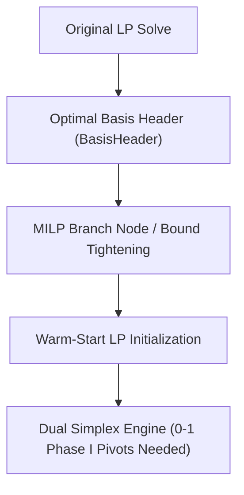

# Basis Management & Re-optimization Specification

In XENITH, the **Basis** is managed as a first-class solver concept (`xenith/solver/lp/BasisManager`). It encapsulates variable basis states, controls factorizations, and enables warm-start re-optimization.

---

## 🏷️ Variable Basis Status Types

Every variable $x_j$ (and row slack $s_i$) maintains one of five distinct basis status states:

1. **BASIC**: Variable is currently part of the basis matrix $B$. Value is determined by solving $B x_B = b - A_N x_N$.
2. **AT_LOWER**: Nonbasic variable pinned at its lower bound $x_j = l_x[j]$.
3. **AT_UPPER**: Nonbasic variable pinned at its upper bound $x_j = u_x[j]$.
4. **FREE**: Nonbasic variable with no bounds ($l_x[j] = -\infty, u_x[j] = +\infty$). Value is pinned at $0$.
5. **SUPERBASIC**: Variable in interior point or non-basic state between bounds (used in advanced non-linear or QP routines).

---

## 🏗️ Basis Matrix Structure & Invariants

The Basis Matrix $B \in \mathbb{R}^{m \times m}$ is constructed from column vectors of constraint matrix $A$ and identity columns corresponding to row slacks:

$$B = [A_{:, j_1}, A_{:, j_2}, \dots, A_{:, j_m}]$$

### Invariants Maintained by BasisManager:
1. **Dimension Correctness**: $B$ always contains exactly $m$ columns (where $m$ is total constraint count including slacks).
2. **Nonsingularity**: $\det(B) \neq 0$. The condition number $\kappa(B)$ must remain within numerically acceptable limits.
3. **Bijection Mapping**: `basic_index_to_var[k]` maps basis position $k \in \{0, \dots, m-1\}$ to model variable index $j \in \{0, \dots, n+m-1\}$. `var_to_basis_index[j]` provides the inverse mapping.

---

## 🔄 Warm-Start & Re-optimization Architecture

Re-optimization is essential for efficient MILP solving (resolving LP relaxations after branch child node creation or cutting plane additions) and interactive resolve:

### Warm-Start Data Structure (`BasisHeader`):
- Array of basis status flags for all variables and slacks.
- Previous factorization status hints.

### Re-optimization Execution Rules:
1. **Preserve Basis Across Solve Calls**: When bounds $l_x, u_x$ or row bounds $l_r, u_r$ are tightened during branch-and-bound, the previous optimal basis is loaded directly into `BasisManager`.
2. **Dual Simplex Fast Track**: Dual Simplex starts directly from the warm-start basis. Dual feasibility is maintained, allowing convergence in a fraction of Phase I/II iterations.
