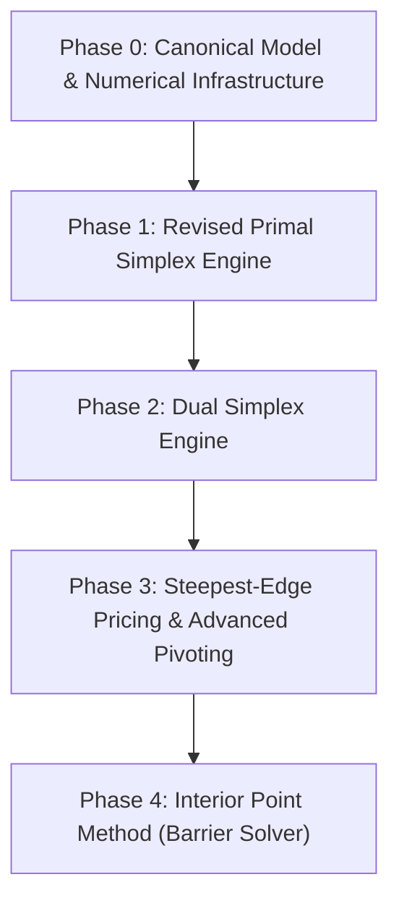

# XENITH LP Solver Overview

Linear Programming (LP) is the fundamental core optimization engine of XENITH. High correctness, numerical stability, and computational performance on standard LP benchmarks (such as Netlib) are pre-requisites for all downstream solvers (MILP, QP).

---

## 🎯 Primary LP Algorithmic Progression

---

## 🔬 Algorithmic Choices: Primal vs. Dual Simplex

### 1. Revised Primal Simplex
- Operates by moving along vertices of the primal feasible polyhedron.
- Ideal when an initial primal feasible basis is readily available or easily constructed via Phase I.
- Serves as the primary baseline implementation for initial verification.

### 2. Dual Simplex
- Operates on dual feasibility while iteratively working toward primal feasibility.
- Critical for modern high-performance LP solving.
- Essential for MILP branch-and-bound, as adding cutting planes or bound constraints maintains dual feasibility, allowing fast re-optimization.

---

## 📐 Decoupled Architectural Breakdown

| Component | Responsibility | Relevant Docs |
| :--- | :--- | :--- |
| **Revised Simplex Loop** | Pivot selection, pricing, ratio test, phase transition | [revised_simplex.md](revised_simplex.md) |
| **Basis Manager** | Tracks basic/nonbasic variable indices, status flags | [basis.md](basis.md) |
| **LU Factorization** | Sparse LU decomposition, BTRAN/FTRAN solves, FT updates | [factorization.md](factorization.md) |
| **Numerical Core** | Vector inner products, matrix-vector multiplications | [`../../architecture/numerical_architecture.md`](../../architecture/numerical_architecture.md) |
