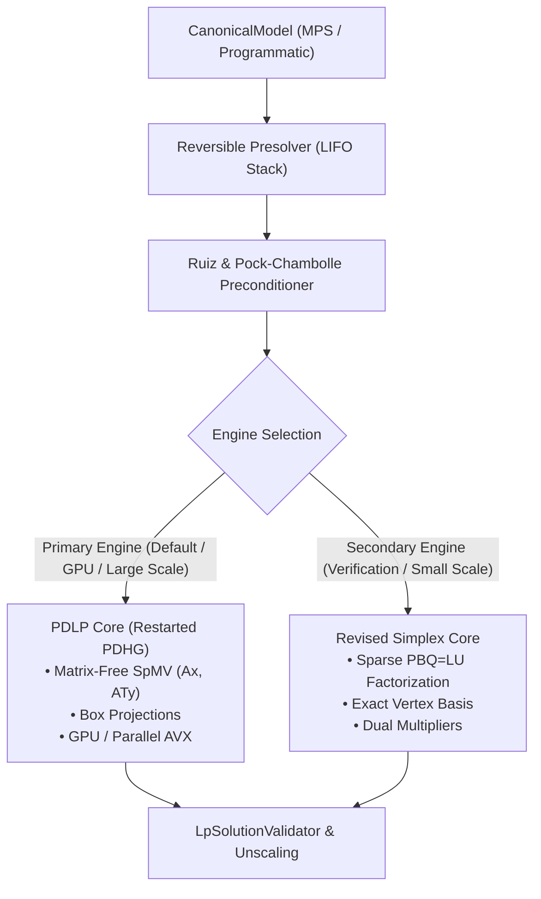

# XENITH LP Solver Overview

Linear Programming (LP) is the fundamental core optimization engine of XENITH. High correctness, numerical stability, and computational performance on standard LP benchmarks (such as Netlib and MIPLIB relaxations) are prerequisites for all downstream solvers (MILP, QP).

---

## 🎯 Primary LP Algorithmic Architecture: The Dual-Engine Strategy

XENITH employs a **dual-engine strategy** to balance extreme scalability on modern hardware (GPU / AVX-512) with exact extreme-point vertex precision:

---

## 🔬 Solver Engines Breakdown

### 1. Matrix-Free PDLP Engine (Primary Engine)
- **Algorithm**: Restarted Primal-Dual Hybrid Gradient (PDHG / PDLP / cuPDLPx) applied to saddle-point LP formulation.
- **Complexity**: $O(\text{nnz})$ per iteration. No matrix factorizations.
- **Hardware Profile**: Highly parallel, bandwidth-bound; scales to $10^7+$ variables; native GPU (CUDA/cuSPARSE) and CPU SIMD (AVX-512) execution.
- **Algorithmic Enhancements**: Ruiz $\ell_\infty$ equilibration, Pock-Chambolle $\ell_1$ scaling, adaptive KKT error restarts, dynamic primal weight ($\omega$) balancing.

### 2. Revised Simplex Engine (Secondary / Verifier Engine)
- **Algorithm**: Two-Phase Revised Primal Simplex with bounded variables.
- **Factorization**: Sparse $PBQ = LU$ decomposition with Markowitz threshold pivoting.
- **Role**: Provides exact basic feasible solutions (vertices) for verification, benchmark comparison, and warm-starting.

---

## 📐 Decoupled Architectural Breakdown

| Component | Responsibility | Relevant Docs |
| :--- | :--- | :--- |
| **PDLP Solver Engine** | Matrix-free restarted PDHG loop, KKT checks, adaptive restarts | [pdlp.md](pdlp.md) |
| **Presolve System** | Empty row/col elimination, bound tightening, LIFO postsolve | [`../../architecture/presolve_design.md`](../../architecture/presolve_design.md) |
| **Diagonal Preconditioner** | Ruiz equilibration & Pock-Chambolle scaling | [`../../architecture/numerical_architecture.md`](../../architecture/numerical_architecture.md) |
| **Revised Simplex Loop** | Pivot selection, Dantzig pricing, Bland's ratio test, Phase I/II | [revised_simplex.md](revised_simplex.md) |
| **Basis Manager** | Tracks basic/non-basic variable states, status flags | [basis.md](basis.md) |
| **LU Factorization** | Sparse LU decomposition, BTRAN/FTRAN solves | [factorization.md](factorization.md) |
| **Numerical Core** | Vector inner products, SpMV ($Ax, A^Tx$), box projections | [`../../architecture/numerical_architecture.md`](../../architecture/numerical_architecture.md) |

