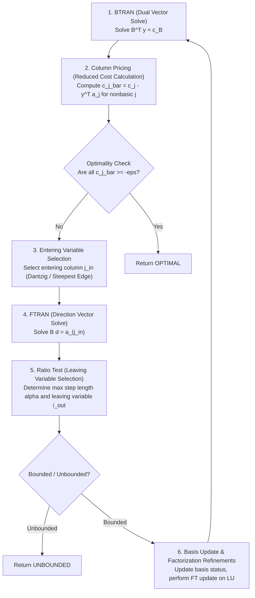

# Revised Simplex Algorithm Specification

The **Revised Simplex Method** maintains the basis matrix $B$ implicitly or explicitly via factorizations ($B = L U$), avoiding full tableau updates.

---

## 🧮 Mathematical Formulation

Given an LP in standard form:
$$\min c^T x \quad \text{s.t.} \quad A x = b, \quad l_x \le x \le u_x$$

Partition variables into basic ($B$) and nonbasic ($N$) sets:
$$A_B x_B + A_N x_N = b \implies x_B = B^{-1}(b - A_N x_N)$$

Objective function value:
$$z = c_B^T x_B + c_N^T x_N = c_B^T B^{-1} b + (c_N^T - c_B^T B^{-1} A_N) x_N$$

Define dual vector $y$:
$$B^T y = c_B \implies y^T = c_B^T B^{-1}$$

Define reduced cost vector for nonbasic variable $j$:
$$\bar{c}_j = c_j - y^T A_{:,j}$$

---

## 🔄 Simplex Iteration Execution Steps

Each pivot step follows a deterministic sequence:

---

## 📊 Phase I & Phase II Strategy

1. **Phase I (Feasibility Search)**:
   - If initial starting point violates variable bounds or constraint ranges, introduce artificial variables or solve Phase I objective minimizing sum of primal infeasibilities.
2. **Phase II (Optimality Search)**:
   - Once primal feasibility is achieved ($\text{infeasibility} < \epsilon_{\text{primal}}$), transition seamlessly to optimizing the original objective function $c^T x$.
