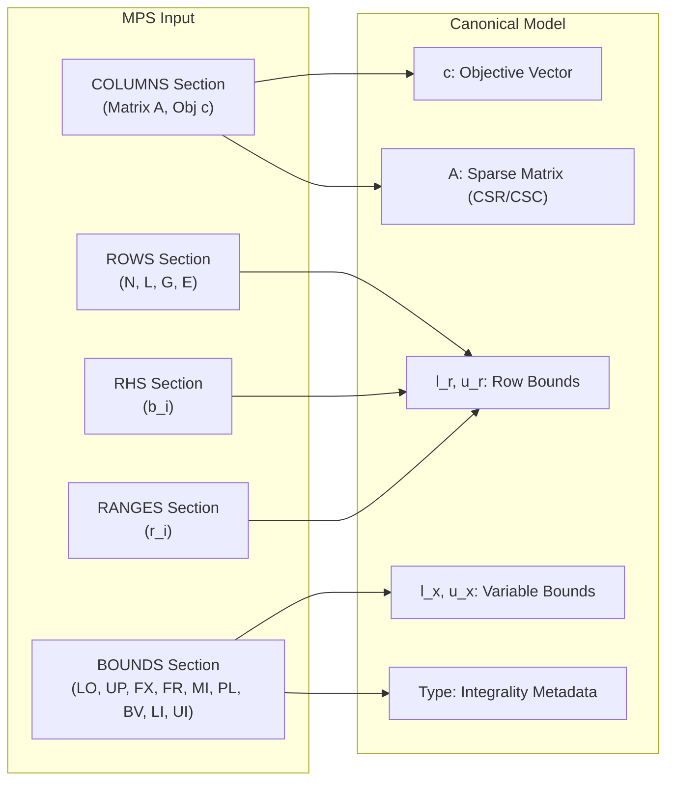

# XENITH Canonical Model Specification

The **Canonical Model** is the central mathematical representation in XENITH. All input formats (MPS, future LP format, Python/C++ APIs) must map into this uniform internal structure before model validation, presolve, or solving occurs.

---

## 📐 Mathematical Formulation

XENITH adopts a **Bounded-Row Canonical LP Form**:

$$\begin{aligned}
\min \quad & c^T x \quad (\text{or } \max c^T x) \\
\text{subject to} \quad & l_r \le A x \le u_r \\
\text{and} \quad & l_x \le x \le u_x
\end{aligned}$$

where:
- $x \in \mathbb{R}^n$ is the $n$-dimensional decision variable vector.
- $c \in \mathbb{R}^n$ is the objective coefficient vector.
- $A \in \mathbb{R}^{m \times n}$ is the sparse constraint matrix with $m$ rows and $n$ columns.
- $l_r, u_r \in (\mathbb{R} \cup \{-\infty, +\infty\})^m$ are row lower and upper bound vectors.
- $l_x, u_x \in (\mathbb{R} \cup \{-\infty, +\infty\})^n$ are variable lower and upper bound vectors.

---

## 💡 Why the Bounded-Row Representation?

Traditional textbook LP implementations convert constraints into standard form $A x = b, x \ge 0$ using slack variables prior to solver entry. XENITH maintains the bounded-row form in its canonical model for several key reasons:

1. **Native Constraint Representation**:
   - Less-than-or-equal ($\le$): $l_r = -\infty, u_r = b_i$
   - Greater-than-or-equal ($\ge$): $l_r = b_i, u_r = +\infty$
   - Equality ($=$): $l_r = u_r = b_i$
   - Range constraints: $-\infty < l_r < u_r < +\infty$
   - Free rows (objective or unconstrained): $l_r = -\infty, u_r = +\infty$
2. **Compact Storage**: Range constraints do not require adding explicit artificial variables or extra constraint rows during model setup.
3. **Presolve Friendly**: Bound tightening on rows and variables directly modifies $l_r, u_r, l_x, u_x$ without changing matrix topology.
4. **Unified Mapping**: MPS `ROWS`, `RANGES`, and `BOUNDS` sections map losslessly into this formulation.

---

## 🏷️ Future MILP Integrality Metadata

To ensure smooth future expansion to Mixed-Integer Linear Programming (MILP) without refactoring the model layer, each variable $x_j$ carries a variable type metadata field:

- `CONTINUOUS`: $x_j \in \mathbb{R}$
- `GENERAL_INTEGER`: $x_j \in \mathbb{Z}$
- `BINARY`: $x_j \in \{0, 1\}$ (with bounds $l_x = 0, u_x = 1$)
- `SEMI_CONTINUOUS`: $x_j = 0$ or $l_x \le x_j \le u_x$
- `SEMI_INTEGER`: $x_j = 0$ or $x_j \in \mathbb{Z} \cap [l_x, u_x]$

*Note: For Phase 0 and initial LP development, all variables are treated as `CONTINUOUS`. Integrality metadata is preserved for validation and presolve.*

---

## 🔒 Invariants Maintained by Canonical Model

1. **Dimensional Consistency**:
   - $c, l_x, u_x$, and variable types have length $n$ (`num_variables`).
   - $l_r, u_r$ have length $m$ (`num_constraints`).
   - Sparse matrix $A$ has dimension $m \times n$.
2. **Valid Bounds**:
   - $l_x[j] \le u_x[j]$ for all $j \in \{0, \dots, n-1\}$. If $l_x[j] > u_x[j]$, model is flagged infeasible during validation.
   - $l_r[i] \le u_r[i]$ for all $i \in \{0, \dots, m-1\}$. If $l_r[i] > u_r[i]$, model is flagged infeasible during validation.
3. **No Non-Finite Matrix Entries**: Sparse matrix entries must be finite non-zero real numbers ($|A_{ij}| > 0$, no $\text{NaN}$ or $\pm\infty$).
4. **Deterministic Variable & Constraint Names**: Every row and column has unique string identifiers with efficient integer index lookup tables.

---

## 🗺️ Mapping External Inputs to Canonical Model

---

## 📝 Documented Implementation Rules

- Do **NOT** embed simplex slack variables directly into `CanonicalModel`. Slack introduction occurs internally within the LP solver's algorithm workspace.
- The `CanonicalModel` owns its numerical data immutably after model construction and validation. Presolve produces a *new* reduced `CanonicalModel` rather than mutating the original model in place.
