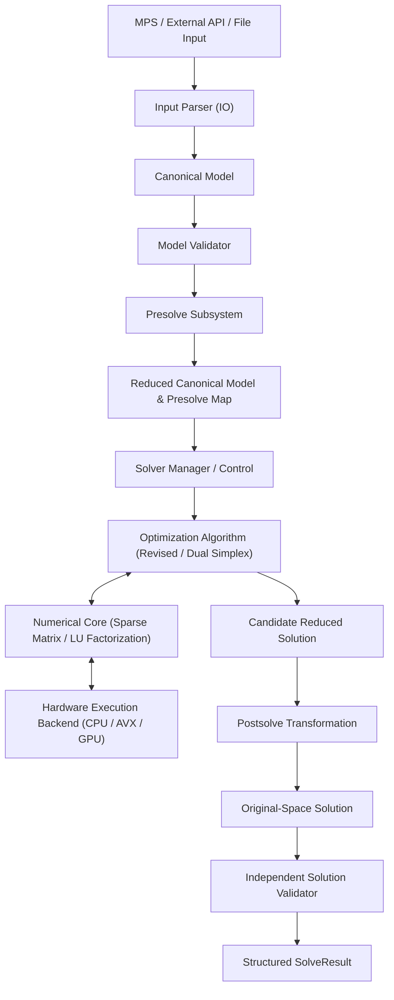

# XENITH System Architecture Overview

XENITH is architected as a modular, high-performance mathematical optimization **solver system** rather than a monolithic solver class.

---

## 🏗️ Core Architectural Principle

The central governing rule of XENITH is strict decoupling across layers:

$$\text{INPUT FORMAT} \neq \text{CANONICAL MODEL} \neq \text{SOLVER ALGORITHM} \neq \text{NUMERICAL RUNTIME}$$

- **Input Formats** (MPS, future LP file format, Python API, C++ API) parse text or structures into a standardized intermediate representation.
- **Canonical Model** holds the pure mathematical model ($\min/\max c^T x$ subject to bounded rows and variable bounds). It contains zero solver state or format artifacts.
- **Presolve Subsystem** performs reversible model reduction without knowledge of specific solver algorithm details.
- **Solver Controllers & Algorithms** implement optimization algorithms (e.g., Revised Simplex, Dual Simplex, Branch-and-Bound) operating on matrix and vector abstractions.
- **Numerical Core** manages linear algebra (sparse matrices, vectors, factorizations, scaling, residual checks).
- **Execution Backend** routes linear algebra operations to optimized hardware targets (generic CPU, SIMD/AVX, future GPU backends).

---

## 🔄 End-to-End System Data Flow

The flow of data through XENITH proceeds in distinct, non-overlapping phases:

---

## 🧩 Subsystem Responsibilities

| Subsystem | Folder | Responsibility |
| :--- | :--- | :--- |
| **Model** | `xenith/model/` | Defines `CanonicalModel`, variable/constraint bounds, integrality metadata, and invariants. |
| **IO** | `xenith/io/` | Parses external formats (MPS, LP) into `CanonicalModel`. |
| **Presolve** | `xenith/presolve/` | Reduces model size (fixed variable elimination, singleton rows/cols) and stores reversible postsolve mapping. |
| **Solver** | `xenith/solver/` | Implements optimization routines (LP revised simplex, dual simplex, future MIP branch-and-bound). |
| **Numerics** | `xenith/numerics/` | Sparse matrix structures (CSR, CSC), sparse vectors, LU factorization, basis updates, scaling, and residual calculation. |
| **Runtime** | `xenith/runtime/` | Multi-threading abstractions, SIMD vectorization wrappers, and hardware backend interfaces. |
| **Solution** | `xenith/solution/` | Holds `SolveResult`, solution metrics, and provides independent solution verification against original constraints. |

---

## 🛡️ Key Architectural Boundaries

1. **Format Independence**: MPS format quirks (such as free/fixed field widths, bound markers) are isolated in `xenith/io/mps/` and never leak into `CanonicalModel` or `Simplex`.
2. **First-Class Basis Abstraction**: The simplex basis is managed as a standalone entity (`BasisMatrix` and `BasisStatus`), preventing direct matrix indexing inside algorithm loops.
3. **Reversible Presolve**: Presolve transformations yield a `PresolveMap` that allows deterministic reconstruction of original primal and dual solution vectors during postsolve.
4. **Hardware Backend Isolation**: Mathematical routines call numerical primitives. Numerical primitives delegate vector/matrix operations to `xenith/runtime/` backends.
