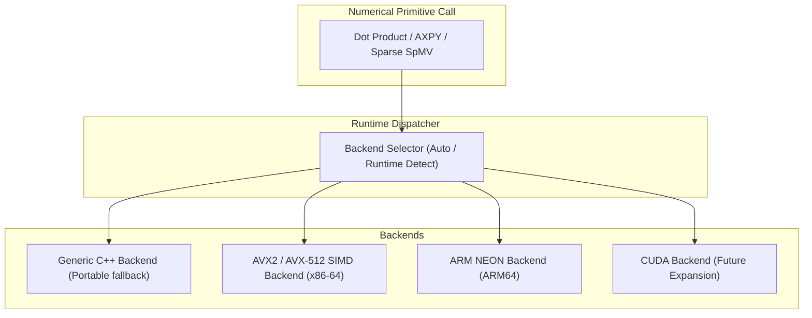

# XENITH Hardware & Runtime Architecture

The **Runtime Subsystem** (`xenith/runtime/`) manages thread allocation, SIMD vectorization, memory management, and hardware backend isolation.

---

## 🌐 Platform Independence Strategy

XENITH is built using ISO C++20 and CMake to ensure cross-platform compatibility across Linux, macOS, and Windows on x86-64 and ARM64 architectures.

### Architectural Rules for Platform Isolation:
1. **Zero OS-Specific Calls in Mathematical Modules**: Platform-specific logic (POSIX threads, Windows threads, system allocators) must never be called directly from `xenith/model/`, `xenith/solver/`, or `xenith/numerics/`.
2. **Execution Backend Wrapper**: All hardware acceleration (AVX-512 vector loops, OpenMP parallel reductions, future CUDA kernels) is isolated inside `xenith/runtime/backends/`.

---

## 💻 Hardware Execution Backends

---

## 🧵 Threading & Concurrency Model

- **Phase 0 Strategy**: Single-threaded, deterministic execution. Correctness and numerical reliability are verified before multi-threading is introduced.
- **Future Multi-Threading Strategy**:
  - Parallel column pricing in Revised Simplex (evaluating reduced cost chunks across worker threads).
  - Parallel branch-and-bound tree evaluation in future MILP solver.
  - OpenMP / std::jthread thread pool abstraction managed by `xenith/runtime/ThreadPool`.

---

## 🧠 Memory Allocation & Cache Efficiency

1. **Contiguous Storage**: Sparse matrices store `values`, `row_ind`, and `col_ptr` in contiguous `std::vector` allocations to maximize L1/L2 cache hit rates during SpMV operations.
2. **Memory Recycling**: Solver workspace buffers (e.g., dense dense direction vector $d$, dual vector $y$) are pre-allocated once upon algorithm initialization and reused across iterations, eliminating runtime heap allocations in inner pivot loops.
