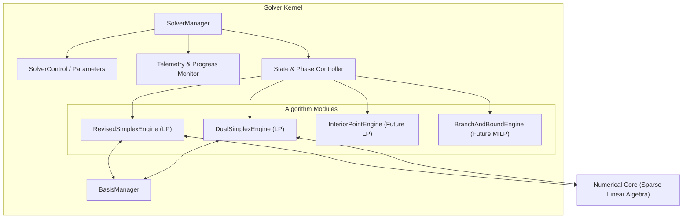

# XENITH Solver Kernel Architecture

The **Solver Kernel** is responsible for orchestrating optimization algorithms, managing solver execution state, enforcing timeout/iteration limits, and mediating between algorithmic logic and the numerical core.

---

## 🏛️ Kernel Component Overview

---

## 🔄 Solver Execution Lifecycle

The solver kernel manages execution via a strict state machine:

1. **Uninitialized**: No model loaded.
2. **Ready**: Model loaded, validated, and presolved.
3. **Solving (Phase I)**: Searching for a initial primal/dual feasible basis.
4. **Solving (Phase II)**: Optimizing objective function value while maintaining feasibility.
5. **Terminated**: Algorithm finished. Status set to `OPTIMAL`, `INFEASIBLE`, `UNBOUNDED`, `ITERATION_LIMIT`, `TIME_LIMIT`, or `NUMERICAL_ERROR`.

---

## 🎛️ Solver Control & Parameters

Solver behavior is configured via `SolverParameters`:

- `primal_feasibility_tolerance` (default: $10^{-6}$)
- `dual_feasibility_tolerance` (default: $10^{-6}$)
- `pivot_tolerance` (default: $10^{-10}$)
- `refactorization_frequency` (default: 50–100 iterations)
- `max_iterations` (default: unlimited / $10^6$)
- `max_time_seconds` (default: unlimited)
- `pricing_strategy` (Steepest Edge, Devex, Dantzig)
- `algorithm_choice` (Auto, PrimalSimplex, DualSimplex)

---

## 🧱 Separation of Algorithm & Numerics

To ensure modularity and clean engineering:

- Algorithmic loops (e.g., pricing step, ratio test, variable selection) reside in the algorithm modules (`xenith/solver/lp/`).
- Matrix operations, B-solve ($B x = b$), B-transpose solve ($B^T y = c$), and LU factorizations are requested through abstract numerical calls (`xenith/numerics/`).
- The algorithm modules do **not** directly inspect internal raw arrays of LU matrices.
