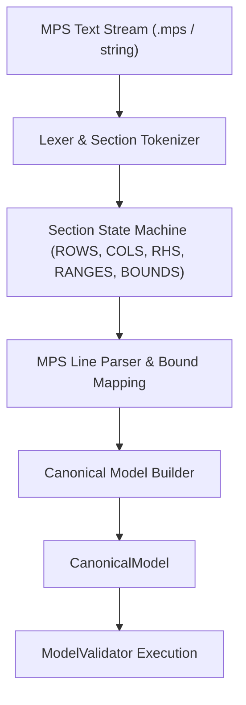

# MPS Parser & Input Pipeline Specification

The **MPS Reader Subsystem** (`xenith/io/mps/`) translates standard Mathematical Programming System (MPS) files into the internal `CanonicalModel`.

---

## 📄 MPS Format Context

MPS is the standard text-based format for linear programming and integer programming benchmark problems (e.g., Netlib, MIPLIB). It is organized into distinct sections:

- `NAME`: Problem title.
- `OBJSENSE`: Explicit objective sense override (`MIN`, `MAX`, `MINIMIZE`, `MAXIMIZE`).
- `ROWS`: Objective row and constraint senses (`N`, `L`, `G`, `E`).
- `COLUMNS`: Non-zero matrix coefficients $A_{ij}$ and objective coefficients $c_j$. Supports integer marker cards (`'MARK0000'`, `'INTORG'`, `'INTEND'`).
- `RHS`: Right-hand side constraint values $b_i$.
- `RANGES`: Range constraint specifications ($r_i$).
- `BOUNDS`: Variable bound types (`LO`, `UP`, `FX`, `FR`, `MI`, `PL`, `BV`, `LI`, `UI`).
- `ENDATA`: End of file marker.

---

## ⚙️ Parsing Pipeline Strategy

---

## 🛠️ Key Design Implementation Details

1. **Fixed & Free Format Support**: The parser automatically tokenizes line cards whether formatted in classic fixed columns (fields at columns 2-3, 5-12, 15-22, 25-36, 40-47, 50-61) or modern space/tab-delimited free format.
2. **Lossless Translation**:
   - `ROWS` entry `N` (Free/Objective) $\rightarrow$ Objective function vector $c$ (first `N` row used if not explicitly selected).
   - `ROWS` entry `L` ($Ax \le b$) $\rightarrow$ $l_r = -\infty, u_r = b_i$.
   - `ROWS` entry `G` ($Ax \ge b$) $\rightarrow$ $l_r = b_i, u_r = +\infty$.
   - `ROWS` entry `E` ($Ax = b$) $\rightarrow$ $l_r = b_i, u_r = b_i$.
   - `RANGES` entry $r_i$ $\rightarrow$ adjusts row lower/upper bounds according to standard MPS range rules.
   - `BOUNDS` mappings:
     - `LO`: Sets $l_x = v$.
     - `UP`: Sets $u_x = v$.
     - `FX`: Sets $l_x = u_x = v$.
     - `FR`: Sets $l_x = -\infty, u_x = +\infty$.
     - `MI`: Sets $l_x = -\infty$.
     - `PL`: Sets $u_x = +\infty$.
     - `BV`: Sets $l_x = 0, u_x = 1$, sets variable type to `BINARY`.
     - `LI`: Sets $l_x = v$, sets variable type to `GENERAL_INTEGER`.
     - `UI`: Sets $u_x = v$, sets variable type to `GENERAL_INTEGER`.
   - Default variable bounds: $l_x = 0, u_x = +\infty$ unless modified by `BOUNDS` section.
3. **Integer Marker Blocks**: Column marker cards (`'MARK0000'`, `'INTORG'`, `'INTEND'`) toggle integer block parsing mode, setting variable integrality metadata (`VariableType::GENERAL_INTEGER`) without introducing synthetic decision variables or matrix entries.
4. **Validation Integration**: `MpsReader` invokes `ModelValidator::validate()` prior to returning the `CanonicalModel` instance. Any dimensional or bound violations trigger diagnostic `MpsParseException` errors.

