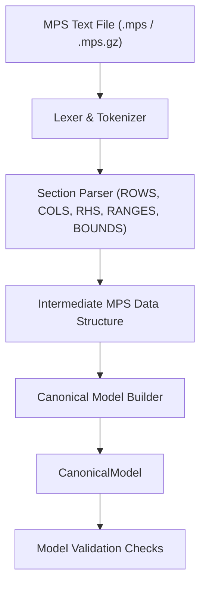

# MPS Parser & Input Pipeline Specification

The **MPS Reader Subsystem** (`xenith/io/mps/`) translates standard Mathematical Programming System (MPS) files into the internal `CanonicalModel`.

---

## 📄 MPS Format Context

MPS is the standard text-based format for linear programming and integer programming benchmark problems (e.g., Netlib, MIPLIB). It is organized into distinct sections:

- `NAME`: Problem title.
- `ROWS`: Objective row and constraint senses (`N`, `L`, `G`, `E`).
- `COLUMNS`: Non-zero matrix coefficients $A_{ij}$ and objective coefficients $c_j$.
- `RHS`: Right-hand side constraint values $b_i$.
- `RANGES`: Range constraint specifications.
- `BOUNDS`: Variable bound types (`LO`, `UP`, `FX`, `FR`, `MI`, `PL`, `BV`, `LI`, `UI`).
- `ENDATA`: End of file marker.

---

## ⚙️ Parsing Pipeline Strategy

---

## 🛠️ Key Design Requirements

1. **Fixed & Free Format Support**: The parser handles traditional 8-character column-aligned MPS files as well as space-delimited free MPS format files.
2. **Lossless Translation**:
   - `ROWS` entry `N` (Free/Objective) $\rightarrow$ Objective function vector $c$ or unconstrained row.
   - `ROWS` entry `L` ($Ax \le b$) $\rightarrow$ $l_r = -\infty, u_r = b_i$.
   - `ROWS` entry `G` ($Ax \ge b$) $\rightarrow$ $l_r = b_i, u_r = +\infty$.
   - `ROWS` entry `E` ($Ax = b$) $\rightarrow$ $l_r = b_i, u_r = b_i$.
   - `RANGES` entry $r_i$ $\rightarrow$ adjusts row lower/upper bounds based on MPS standard rules.
   - Default variable bounds: $l_x = 0, u_x = +\infty$ unless modified by `BOUNDS` section.
3. **Format Quirks Isolation**: MPS section details (e.g., marker cards `'MARK0000'`, column order variations) are processed entirely inside `xenith/io/mps/` and never exposed to the solver core.
