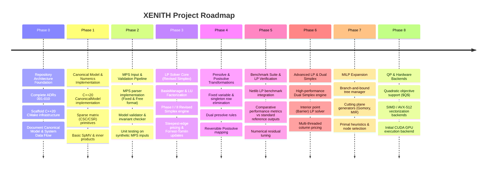

# XENITH Strategic Multi-Phase Roadmap

XENITH is built incrementally from mathematical and engineering foundations.

---

## 🗺️ Multi-Phase Strategic Execution Plan

---

## 🔒 Phase Boundaries & Scope Enforcement

- **Current Phase**: **Phase 0** (Repository Architecture Foundation).
- **Rule**: Do not begin Phase 1+ code implementation until Phase 0 architecture foundation and design documents are fully established and committed.
