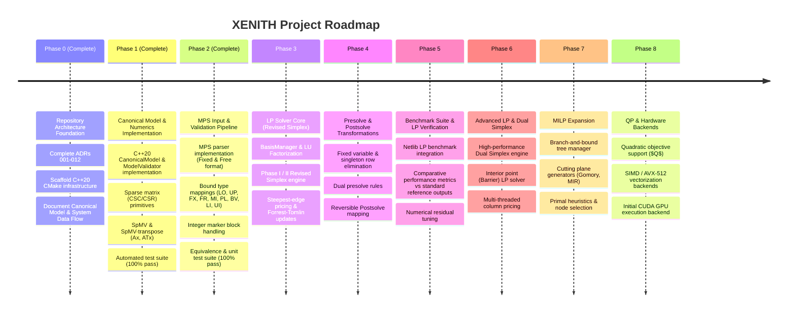

# XENITH Strategic Multi-Phase Roadmap

XENITH is built incrementally from mathematical and engineering foundations.

---

## 🗺️ Multi-Phase Strategic Execution Plan

---

## 🔒 Phase Boundaries & Scope Enforcement

- **Current Phase**: **Phase 2 Complete**. Preparing for **Phase 3** (Basis Management, LU Factorization & FTRAN/BTRAN Solves).
- **Rule**: Do not begin Phase 3+ solver algorithms until Phase 2 MPS input parsing and canonical model creation are established and tested.

