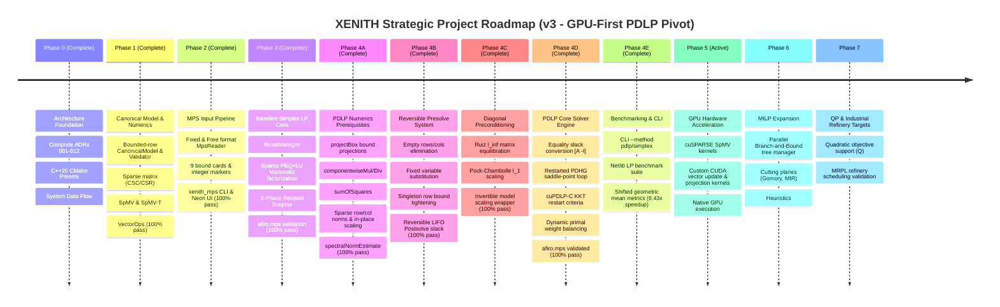

# XENITH Strategic Multi-Phase Roadmap

XENITH is built incrementally from mathematical and engineering foundations. Following our algorithmic research audit ([`sih_26119_research_roadmap.md`](../sih_26119_research_roadmap.md)), the primary continuous solver core has transitioned to **First-Order Matrix-Free Primal-Dual Hybrid Gradient (PDHG / PDLP / cuPDLPx)** to enable massive parallel throughput and native GPU execution.

---

## 🗺️ Multi-Phase Strategic Execution Plan

---

## 🔒 Current Phase Boundaries & Scope Enforcement

- **Current Status**: **Phase 4 Complete (Phase 4A, 4B, 4C, 4D & 4E Complete & Verified)**.
- **Active Sprint**: **Phase 5: GPU Hardware Acceleration (CUDA / cuSPARSE)**.
- **Rule**: Maintain 100% automated test pass rate across all solver capabilities (currently 17/17 tests passing).

