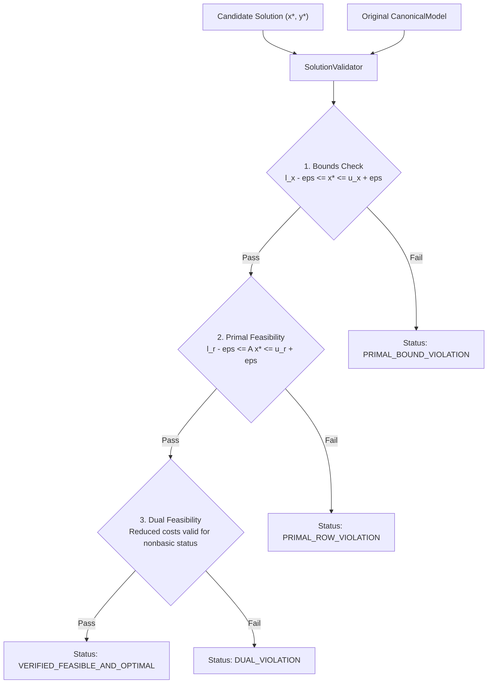

# Solution Validation & Postsolve Specification

A mathematical optimization solver must provide verifiable mathematical proof of solution correctness rather than returning an unvalidated numerical vector.

---

## 📦 `SolveResult` Data Structure

All XENITH solvers return a structured `SolveResult` containing full solution telemetry:

- **`status`**: `OPTIMAL`, `INFEASIBLE`, `UNBOUNDED`, `ITERATION_LIMIT`, `TIME_LIMIT`, `NUMERICAL_ERROR`.
- **`objective_value`**: Final optimal/best objective function value $c^T x^*$.
- **`primal_solution`**: Decision variable vector $x^* \in \mathbb{R}^n$.
- **`dual_solution`**: Dual multiplier vector $y^* \in \mathbb{R}^m$.
- **`reduced_costs`**: Reduced cost vector $\bar{c}^* \in \mathbb{R}^n$.
- **`iterations`**: Total simplex iteration / interior point barrier count.
- **`solve_time_seconds`**: Wall-clock and CPU runtime in seconds.
- **`max_primal_infeasibility`**: $\|A x^* - s\|_{\infty}$ violation.
- **`max_dual_infeasibility`**: Dual constraint violation metric.
- **`integrality_gap`**: Relative MILP gap $\frac{|z_{\text{obj}} - z_{\text{bound}}|}{\max(1, |z_{\text{obj}}|)}$ (for future MILP).

---

## 🔍 Independent Solution Validator

The `SolutionValidator` component checks mathematical correctness **independently** from the solver algorithm that produced the candidate solution:



---

## ↩️ Postsolve Transformation Pipeline

When presolve is active, the solver operates on a reduced model $M_{\text{reduced}}$. The candidate solution $x_{\text{reduced}}^*$ must be un-transformed back to original model space $x_{\text{original}}^*$:

```
Original Model  ──────── Presolve ────────>  Reduced Model
      │                                            │
      │                                         Solver
      │                                            │
Original Solution <────── Postsolve ────── Reduced Solution
```

### Postsolve Steps:
1. **Re-instate Fixed Variables**: Re-insert variables eliminated during presolve, assigning fixed bounds values.
2. **Re-instate Singleton Rows/Cols**: Un-substitute variables removed via row aggregations.
3. **Un-scale Coefficients**: Multiply primal values $x$ and divide dual values $y$ by equilibration scaling factors.
